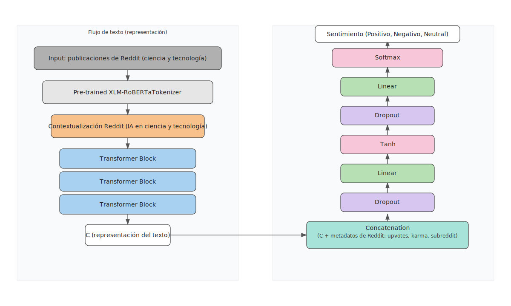

# Análisis de Sentimientos con IA

Un proyecto de clasificación de sentimientos usando modelos de transformers y PyTorch Lightning para analizar el sentimiento de los posts de Reddit frente a la IA.

## Descripción

Este proyecto implementa un sistema de análisis de sentimientos utilizando el modelo XLM-RoBERTa para clasificar textos en español en las siguientes categorías:
- Positivo
- Negativo  
- Neutral

## Estructura del Proyecto

```
├── data/
│   └── silver/          # Datos procesados para entrenamiento
├── src/                 # Código fuente del proyecto
│   ├── config.py        # Configuración del proyecto
│   ├── ingest.py        # Ingesta de datos
│   ├── silver.py        # Procesamiento de datos
│   └── features/        # Extracción de características
├── notebooks/           # Notebooks de experimentación
│   └── 04_silver_sentimiento_dl.ipynb  # Notebook principal
├── artifacts/           # Modelos y métricas guardados
├── outputs/             # Resultados y datos procesados
└── README.md
```

## Características

- Procesamiento de datos multiidioma con detección automática
- Balanceo de clases con pesos calculados automáticamente
- Entrenamiento con PyTorch Lightning para escalabilidad
- Validación cruzada y métricas detalladas
- Pipeline de inferencia optimizado
- Guardado automático de checkpoints del mejor modelo

## Requisitos

- Python 3.8+
- PyTorch
- PyTorch Lightning
- Transformers (Hugging Face)
- Pandas
- Scikit-learn
- Matplotlib
- Seaborn

## Instalación

1. Clona el repositorio:
```bash
git clone https://github.com/feliperosero/analisis_sentimientos_IA.git
cd analisis_sentimientos_IA
```

2. Crea un entorno virtual:
```bash
python -m venv .venv
source .venv/bin/activate  # En Linux/Mac
# o
.venv\Scripts\activate     # En Windows
```

3. Instala las dependencias:
```bash
pip install torch pytorch-lightning transformers pandas scikit-learn matplotlib seaborn tqdm langdetect pyarrow
```

## Uso

### Entrenamiento

Ejecuta el notebook principal `notebooks/04_silver_sentimiento_dl.ipynb` para:
1. Cargar y preprocesar los datos
2. Configurar el modelo XLM-RoBERTa
3. Entrenar con validación cruzada
4. Evaluar métricas de rendimiento
5. Guardar el modelo entrenado

### Inferencia

Utiliza la clase `SentimentInferencePipeline` para hacer predicciones:

```python
from src.predict_A import SentimentInferencePipeline

pipeline = SentimentInferencePipeline.load_from_checkpoint("ruta/al/modelo.ckpt")
result = pipeline.predict("Este es un texto de ejemplo")
print(f"Sentimiento: {result['label']}, Confianza: {result['confidence']:.3f}")
```

## Métricas de Rendimiento

El modelo ha sido evaluado utilizando:
- Precisión (Precision)
- Recall
- F1-Score
- Matriz de confusión
- Distribución de confianza por clase

Los resultados se guardan automáticamente en `artifacts/` y se generan visualizaciones en `artifacts/plots/`.

## Datos

### Identificación y autoría
- id, autor, autor_nombre_completo, autor_premium, autor_patreon, autor_bloqueado
- autor_flair_texto, autor_flair_css, autor_flair_tipo, autor_flair_richtext_json

### Contenido principal
- titulo, texto, titulo_limpio, texto_limpio
- dominio, url, url_destino, enlace_permanente
- flair_texto, flair_css, flair_tipo, flair_richtext_json
- pista_contenido

### Subreddit
- subreddit_nombre, subreddit_id, subreddit_prefijado, subreddit_tipo, subreddit_suscriptores

### Tiempos/estado
- fecha_creacion_utc, fecha_creacion, editado, editado_fecha, distinguido
- esta_bloqueado, archivado, en_cuarentena, esta_fijado
- es_original, es_meta, es_compartible
- orden_sugerido, tipo_discusion
- _ingest_ts, _ingest_ts_ts

### Interacciones
- puntaje, votos_positivos, votos_negativos, ratio_upvotes
- total_comentarios, total_republicaciones, vistas
- visitado, ocultar_puntaje, enviar_respuestas, puede_mod
- total_premios, gilded

### Seguridad / flags
- es_texto, es_adulto, es_spoiler, indexable_por_robot

### Media/embeds
- es_video, es_galeria, solo_media
- miniatura, miniatura_alto, miniatura_ancho
- media_json, media_segura_json, media_embed_json, media_segura_embed_json
- previsualizacion_json, datos_galeria_json, metadatos_media_json
- lista_republicaciones_json, padre_republicacion

### Metadatos adicionales
- estado_lista_blanca_padre, estado_lista_blanca, wls, pwls
- categorias_contenido_json, etiquetas_tratamiento_json
- premiadores_json, premiaciones_json, gildings_json, datos_encuesta_json
- raw_payload, extras

## Diagrama de arquitectura

El diagrama conceptual de la arquitectura del modelo se encuentra en `artifacts/diagrama_arq_sentimientos.svg`.


